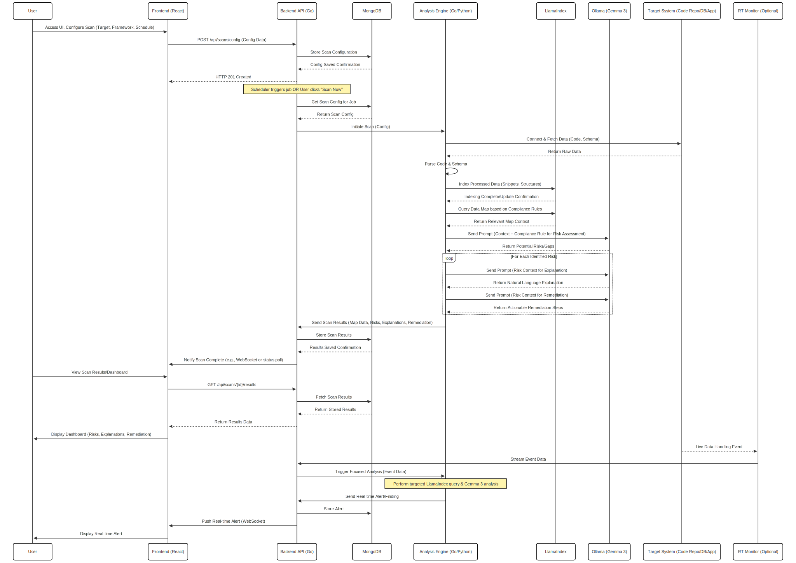

# 🛡️ Intelligent Data Privacy Auditor

An AI-powered platform to scan applications, APIs, and databases for privacy risks and compliance gaps (e.g., **GDPR**, **CCPA**).  
Built with **Go**, **React**, **MongoDB**, and cutting-edge LLMs via **LlamaIndex** and **Gemma 3 (Ollama)**.

## ✨ Features

- 🔍 **AI-Driven Compliance Scanning** – Detects violations or risks using contextual analysis.
- 🧠 **LLM-Powered Auditing** – Uses LlamaIndex + Gemma 3 for deep explanations and remediation.
- ⚙️ **Flexible Configuration** – Target code repositories, databases, or API endpoints.
- 📊 **Modern Dashboard** – View risks, explanations, and fixes in a sleek UI.
- 🔄 **Real-Time Monitoring (Optional)** – Live event detection and streaming alerts.
- 🧩 **Open Source & Extensible** – Easily add new compliance rules, scanners, and data connectors.

---

## 🧱 Architecture Overview

The system follows a microservices-friendly design with clear separation of responsibilities.

## 🖼️ Architecture Diagram

